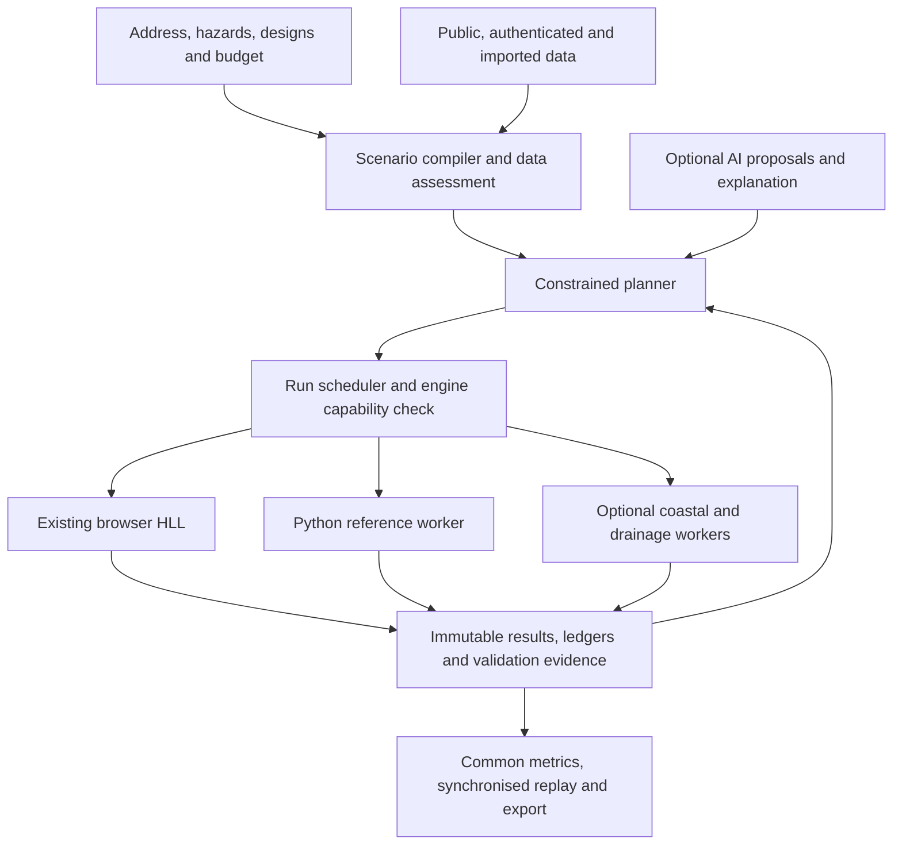

# SPONGE architecture v2 — full flood and intervention planning

Decision date: September 14, 2026. Status: accepted design direction; migration
work below is not yet implemented. This document supersedes conflicting v1
architecture decisions. Existing acceptance requirements remain unless explicitly
revised here. Historical results retain their original solver and input identities.

Implementation update: the first [scenario composition runtime increment](scenario-composition.md)
now supports independent forcing toggles and preserves legacy behavior. The full
wire schema, data/engine adapters and subsequent migration work below remain pending.

## Product commitment

Keep address discovery, real 3D terrain and buildings, rainfall scenarios,
coastal flooding, supplied river/external inflows, drainage, all four green
infrastructure types, budgeted planning, manual editing, alternatives, synchronised
replay, damage economics and evidence exports. Combined rainfall, inflow and
coastal scenarios are an explicit target. The intended decision remains: where
can this budget improve flooding, and what risk remains?

The user's latest instruction permits architectural changes and API-key-based
services consistent with the event rules. A runtime AI service is optional again,
not mandatory and not restricted to Claude. Existing deterministic planning
remains usable. No account, subscription, paid usage or deployment is activated
by this architecture document. Earlier paused demo/release tasks remain tracked
separately; an architecture update does not mark them completed.

## What the current code actually supports

| Component | Current evidence / limit | Design decision |
|---|---|---|
| Location preparation | Worldwide name lookup and coordinates; 80°S–80°N preparation envelope; Ozone live load verified | Keep general ingestion; assess data separately for each hazard and requested domain |
| Surface simulation | Browser HLL and Python reference, conservation/replay checks | Retain production baseline; introduce adapters without changing equations initially |
| Scenario selection | `FloodInputs.tsx` selects rain, external, rain + external, or coastal; `scenario-input.ts` excludes coastal from other modes | Replace mutual exclusion with explicit independent forcing components |
| Coastal | One prescribed reservoir boundary; no validated regional surge generation | Keep exploratory mode; add admitted spatial boundary series and specialized execution later |
| Drainage | Parameterised outlets; `swmm_network.py` is experimental, reports failing whole-network conservation, and is not coupled in production | Preserve outlet mode; audit SWMM independently before enabling two-way exchange |
| Planning | Browser simulation-backed bounded subset search, four intervention types, assumed costs/eligibility | Evaluate combined plans against explicit objectives and robustness scenarios |
| Historical validation | Sparse coastal marks, dry misses, unresolved settings; Dorian forcing gaps | Separate numerical, reference, observed and intervention evidence |
| Reporting | Shared limitations and reproducible exports; defensible valuations missing | Retain unavailable economics until inventory/curves justify them |

## 1. Compose hazards using one canonical scenario

Introduce a versioned `ScenarioSpecV2`, generated and validated in Python and
TypeScript from one schema. It describes physical inputs before any engine
translation. UI presets are conveniences; they never silently disable a source.

Required sections:

- `domain`: bundle hash, horizontal CRS, vertical datum and epoch, local origin,
  extent, grid identity, terrain and building versions, optional bathymetry.
- `clock`: UTC start, duration, recession/output schedule, initial-state hash.
- `rainfall`: disabled, sourced time series, or explicitly assumed design event;
  units, source interval and spatial support. A return period requires a regional
  rainfall-frequency source; it is not a flood-depth probability.
- `inflows`: spatial support, hydrographs, units and momentum assumptions.
- `coastal`: disabled or supported boundary segments with water-level series,
  datum transformation evidence, gaps and spatial interpolation method. Distinguish
  observed total water level, regional model output and assumed levels. Never add
  tide twice when a supplied series already includes it.
- `drainage`: none, parameterised outlets, or a supplied network with coupling
  specification. Every sink has a destination and a ledger entry.
- `materials`, `initialConditions`, `design`, `outputSchedule`, `assumptions` and
  `requestedCapabilities`: explicit versioned references.

The compiler returns either `ExecutableScenario` or structured errors with input
paths and resolutions. Unsupported components cannot disappear during compilation.
Legacy scenario migration must reproduce the old effective rain, inflows, coastal
initialisation and recession exactly; keep old hashes in a migration record rather
than assigning a new hash to an old run.

Acceptance: every legacy preset yields equivalent compiled arrays; a rainfall +
coastal case retains both sources; missing coastal configuration fails clearly;
overlapping boundary/source cells require an explicit policy; edits invalidate
run, comparison and planner caches together. Combined forcing must pass CPU/GPU
ledger and timing checks before appearing as an available product mode.

## 2. Use one run interface with explicit engine capabilities

An `EngineAdapter` provides capabilities, input validation, resource estimate,
prepare/start/progress/cancel, result publication and supported restart semantics.
Engine capabilities enumerate forcing, grid, boundary, GI, network and output
support. A unsupported design must be rejected, not approximated without consent.
The scheduler shows engine, resolution and runtime estimate before execution.
No silent fallback from GPU to another set of equations.

Result identity includes canonical scenario, compiled inputs, engine version/build,
numerical options, physical output times and source hashes. Checkpoints are
engine-specific. Native grids and arrays remain archived; a display reprojection
is not used for quantitative scoring. Missing velocity or arrival output remains
unavailable rather than manufactured for a common UI.

Keep a baseline and candidate on the same engine/settings for a planning result.
Comparisons between engines are separately labelled reference experiments.
Queue long specialist runs on existing RQ workers; start with process isolation,
not a new service fleet. Retain session isolation, idempotency, quotas and atomic
manifest publication. Extract orchestration from `App.tsx` incrementally after the
scenario contract is established; avoid a broad rewrite during solver validation.

### Specialist choices to investigate

**EPA SWMM:** selected for continued drainage/network reference work. EPA describes
SWMM as freely available software with stormwater and green-infrastructure
modelling support. This supports using the established engine; it does not validate
our current coupling. Keep the existing experiment blocked from production until
whole-network continuity, bidirectional exchange, surcharge, dry startup, tailwater
and timestep convergence pass. Surface/interface/network storage must each be
counted once. [EPA source](https://www.epa.gov/water-research/storm-water-management-model-swmm)

**Deltares SFINCS:** selected for a bounded coastal/compound comparison spike,
not as an automatic replacement. Deltares describes a reduced-physics compound
flood model. The current main-branch LICENSE is GPL v3; an older repository
description mentions Deltares Freeware. Pin the exact chosen release, inspect its
license/notices, and preserve distribution obligations with any bundled engine.
Use an external executable adapter initially; this does not itself settle license
obligations. Evaluate matched inputs, numerical differences, runtime and accepted
observations before adoption. Do not claim that switching engines fixes missing
bathymetry, datum mismatches or forcing gaps.
[Deltares](https://www.deltares.nl/en/software-and-data/products/sfincs) ·
[Current LICENSE](https://github.com/Deltares/SFINCS/blob/main/LICENSE)

Waves, wind and regional surge generation are explicit engine capabilities, not
effects inferred from a rising reservoir. Extend these through sourced forcing
and validated adapters as required; the current UI remains exploratory meanwhile.

## 3. Assess data for the selected hazard

Replace a single ready/not-ready impression with separate fields for acquisition,
physical compatibility and validation evidence. A found address says nothing about
whether a coastal domain is supported. Proposed `CoverageAssessment` contains:

- source, acquisition date, native resolution, spatial completeness and license;
- terrain/water-level datum and transformation uncertainty;
- event rainfall or coastal forcing interval and support, bathymetry/channel needs;
- drainage geometry/capacities, soils, parcels/eligibility and building valuations;
- `ready`, `exploratory`, `needs_data`, `needs_access`, or `unsupported` per capability,
  with evidence IDs and actionable reasons. These are data readiness states, not
  accuracy badges.

Coastal domains should follow hydraulic connectivity and boundary support rather
than the visible map square. A larger context domain may drive a detailed area,
but transfer of stages/fluxes needs conservation and interpolation tests. Missing
forcing cannot become a wall or cross-island nearest-neighbour value. Keep Dorian
as diagnostic evidence until its input gates pass; do not consume more held-out
observations to tune around unresolved geometry.

Authenticated data adapters keep keys server-side, record quota/access status and
redact secrets from URLs, logs and exported manifests. Public data, user uploads
and caches remain first-class. Provider choice follows usable resolution, date,
license and uncertainty, not simply whether a key is required. Entitlements and
spending ceilings are separate from hackathon eligibility.

## 4. Plan and explain using evaluated evidence

Keep four GI types, finite storage, maintenance/clogging cases, editable constraints,
locks, exclusions and alternatives. Separate eligibility evidence from the user's
explicit exploratory assumption. Compare budgets in a declared currency and price
year; include maintenance assumptions without pretending they are measured costs.

Planning evaluates the same forcing/domain/engine/initial conditions for all
designs. Add an ensemble objective over rainfall intensity/duration, antecedent
wetness, drainage capacity and coastal timing where supported. Report tradeoffs,
worst-case residual exposure, failed scenarios and local worsening. A rain garden
may offer little benefit against coastal inundation; a valid outcome is no useful
feasible GI plan. Do not force a winning design.

AI may interpret user constraints, propose catalogue IDs, summarise alternatives
and explain missing data. It cannot fabricate parameters, change equations, approve
eligibility or supply metric values. Schema validation and actual resimulation
remain mandatory. Model/provider identity, prompt version, budget and proposal
provenance are recorded; key absence and outages retain deterministic/manual
planning. Selecting an AI provider is deferred until an actual product benefit
is demonstrated. Restoring a mandatory Claude dependency is not necessary.

Damage remains a required capability with data gates: first-floor elevations,
building use, defensible replacement values, suitable curves, currency/year and
coverage. Show physical exposure when these are absent. Coastal and rainfall
comparisons cannot share an economic claim without checking applicable loss
assumptions. Rendering and AI prose never calculate authoritative damage.

## 5. Validate each claim independently

Maintain four evidence layers: numerical verification; independent engine/reference
agreement; observed-event skill; intervention benefit. Record hazard, model version,
domain, input quality and observation cohort in every claim. No global accuracy
percentage is inferred from wet-point RMSE or water conservation.

For each proposed physics change: state a hypothesis, freeze inputs/criteria, run
controlled tests and prior-event regressions, then evaluate a different admissible
event. After observations inform a change, mark that event as development evidence.
Separate rainfall and coastal benchmark queues so blocked coastal inputs do not
prevent validation of the central rainfall/intervention workflow.

Metrics include stage/depth RMSE and bias, dry misses, unsupported observations,
extent precision/recall/IoU where independent wet AND dry evidence exists, and
arrival/duration errors where time traces exist. Report observation uncertainty
and correlated sites. Model-to-model agreement is not observed truth. Verify
intervention response against suitable independent controlled cases before
claiming benefit generalizes to real neighbourhoods.

The default production solver remains frozen while its replacement is unproven.
Architecture work alone changes no accuracy claims. Failed experimental candidates
stay out of runtime selection. All methods may be improved when evidence supports
the change; the freeze is a regression baseline, not a permanent product limit.

## 6. Migration order and completion gates

| Order | Deliverable | Acceptance and dependency |
|---|---|---|
| 1 | Canonical composable scenario + legacy migration | Preserve all existing modes; no lost forcing or stale identities; contract fixtures and existing replay regressions |
| 2 | Capability/data assessment + HLL/reference adapters | Explicit unsupported states; unchanged baseline arrays/results; bounded jobs/cancellation |
| 3 | Rainfall and GI validation track | Admit event-matched inputs and independent observations; controlled intervention cases; report misses and uncertainty |
| 4 | Coastal/compound track | Audit SFINCS release; matched reference spike; complete datum/boundary/terrain support; separate new-event validation |
| 5 | Drainage and robust planning | Resolve SWMM whole-network continuity before coupling; compare feasible GI ensembles and expose no-benefit plans |
| 6 | Valuation and optional AI adapters | Sourced inventory/curves and coverage; evidence-bound proposals; deterministic outage path |
| 7 | Complete product verification | Reconcile original acceptance IDs with evidence; measure cold load and replay smoothness; verify exports across enabled hazards |

Orders 3 and 4 are independent work tracks after the shared contracts. They do
not require running experimental solvers inside the interactive production app.
Demo, deployment and submission deliverables remain separate work items under
the user's existing pause; they are not deleted from the full product scope.

## Event alignment, checked September 14, 2026

The official theme is Earth Forward, including climate resilience. Published
rules do not prohibit APIs or API keys; that is an interpretation of the posted
rules, not a direct organiser approval of every service. Credit third-party code,
models and data and distinguish our integration/planning/UI contributions from
upstream solvers. No copied model can be presented as original SPONGE physics.

The current displayed deadline is September 20 at 17:00 EDT (September 21 at
02:30 IST). Preserve the 3–5 minute video requirement, viewable code and applicable
live link. The overview permits older work with before/during disclosure while
the rules use stricter within-period wording; retain that discrepancy instead
of treating disclosure as blanket clearance. The user states they are a student
and age 20; team size still needs recording. None of these administrative items
is silently marked complete here.

[Official rules](https://nextstep2026.devpost.com/rules) ·
[Overview and submission requirements](https://nextstep2026.devpost.com/)

## This revision's evidence boundary

Delivered: architecture decisions, current-code audit, source/license review,
updated scope and acceptance requirements, migration order. Not delivered by
this revision: combined-hazard runtime, SFINCS execution, repaired SWMM coupling,
new observed accuracy scores, authenticated integrations or release assets.
