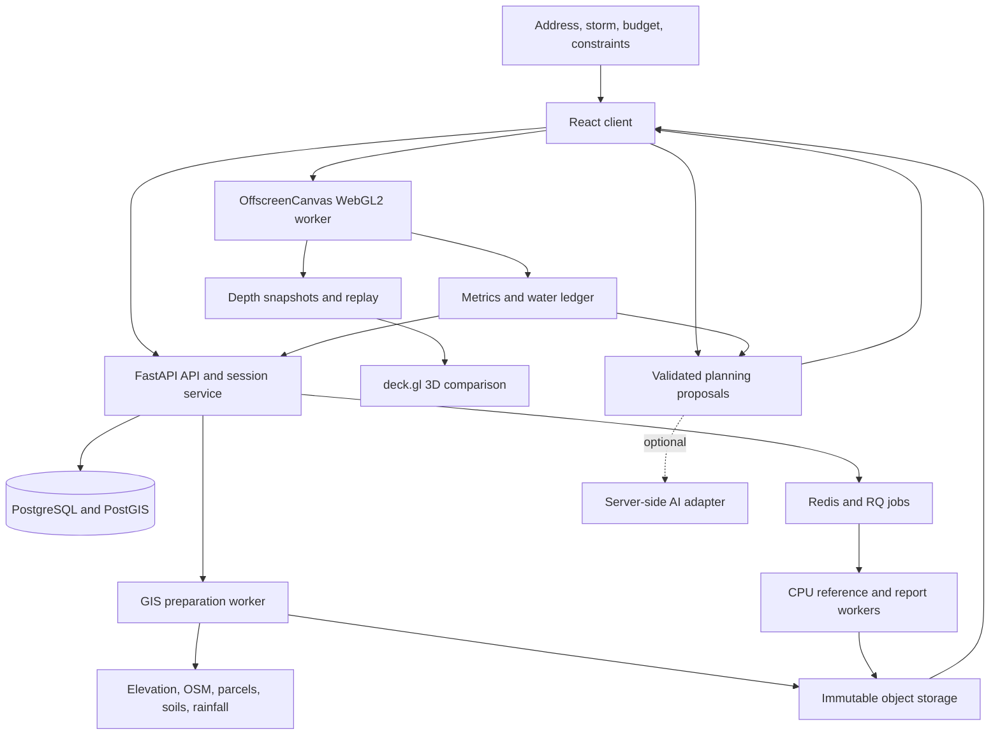

> Current decision (2026-09-14): [Architecture v2](architecture-v2.md) governs full rainfall, coastal and compound scope, composable scenarios, engine adapters and optional authenticated/AI services. It supersedes conflicting v1 restrictions and mandatory Claude requirements. Runtime capabilities must still be verified; this notice does not mark them implemented.

# SPONGE system architecture

Architecture v1, 2026-09-10. Implements [all PRD epics](prd.md). Detailed numerical contracts are in [numerics.md](numerics.md); interface contracts are in [contracts.md](contracts.md). This is a build specification, not evidence that the software exists.

## 1. Overview and component boundaries

The browser owns interaction, GPU simulation, candidate evaluation, live visualisation and replay. A preparation service turns geospatial sources into immutable simulation bundles. A provider-neutral planning layer validates proposals; optional server-side AI assistance supplements deterministic search. CPU workers provide reference execution, offline run processing and report generation. Every computation takes explicit versioned inputs and returns an immutable result.



All provider requests requiring identity, retries or quota control go through allowlisted adapters. Raster processing does not run in Vercel serverless functions. Browser GPU and CPU server execute the same physical specification but are separate implementations; this permits cross-checks, not an assumption that either is automatically correct.

## 2. Stack and dependency policy

| Layer | Selected technology | Purpose |
| --- | --- | --- |
| UI | React + TypeScript + Vite | One-map workflow, editor, comparison, report viewer |
| App state | Zustand for local edits; TanStack Query for HTTP state | Separate transient interaction from server resources |
| Scene | deck.gl custom layers + MapLibre GL JS | Terrain/water/buildings and context map |
| GPU | WebGL2, GLSL ES 3.00, EXT_color_buffer_float, OffscreenCanvas worker | Conservative simulation and reductions |
| Local data | IndexedDB | Bundle cache, run snapshots, resumable session state |
| API | Python 3.12, FastAPI, Pydantic, SQLAlchemy, Alembic | Contracts, sessions, provenance, jobs and optional authenticated-provider adapters |
| Geospatial | GDAL/Rasterio, PyProj, Shapely, NumPy | Raster reprojection, geometry and preprocessing |
| Reference | NumPy CPU model; SWMM adapter for supplied networks | Numerical comparisons and non-GPU execution |
| Persistent state | PostgreSQL + PostGIS | Session/resource relationships and spatial indexes |
| Queue | Redis + RQ | Bounded GIS, reference and report jobs |
| Artifacts | S3-compatible storage; local filesystem adapter | Immutable bundles/results with content hashes |
| Reports | Jinja HTML + Playwright print-to-PDF | Deterministic tables and printable comparison |
| Tests | Vitest, pytest, Playwright | Contracts, physics, service and browser checks |
| Packaging | pnpm workspace, uv Python lock, Docker Compose | Reproducible Windows-friendly local and Linux hosted runtime |

At scaffold time select mutually compatible stable versions, pin lockfiles and container image digests, and record them in the build journal. Do not invent version numbers in this design. Test deck.gl, MapLibre, worker WebGL and shader support together before committing to their exact versions. A library upgrade cannot change solver results without rerunning numerical checks.

## 3. Repository layout

```text
apps/
  web/
    src/app/                    application shell, routing and error boundaries
    src/features/address/       geocode, coverage and preparation state
    src/features/storm/         rainfall and antecedent condition editor
    src/features/design/        four GI tools, budget, locks and exclusions
    src/features/planning/      Claude/search progress and alternatives
    src/features/comparison/    paired cameras, timeline and metrics
    src/features/evidence/      sources, uncertainty and report viewer
    src/scene/                  terrain, water, building and parcel layers
    src/state/                  session revision and immutable selectors
    src/storage/                IndexedDB cache and artifact fetch
packages/
  contracts/                    canonical JSON Schema, generated TS, fixtures
  domain/                       units, IDs, costs and physical input validation
  geo-client/                   local grid transforms and spatial picking
  simulation/
    src/                        solver interface, scheduler and GPU resources
    src/worker/                 OffscreenCanvas worker protocol
    shaders/                    flux, update, sources, GI and reductions
  optimizer/                    candidate search, cache, constraints and scoring
  replay/                       chunk encoding, sampling and timeline
  metrics/                      building exposure and deterministic economics
services/
  api/app/                      routes, sessions, auth, jobs and migrations
  api/app/planning/             Claude adapter, validators, evidence narrative
  geodata/                      providers, terrain, materials, parcels, rainfall
  reference/                    float64 solver and optional SWMM coupling
  reporting/                    report templates, figures and PDF generation
data/
  catalogs/                     versioned material, GI, cost and damage catalogs
  manifests/                    small committed dataset manifests
  fixtures/                     licensed small synthetic/reference cases
  local/                        ignored downloaded rasters and local artifacts
tests/
  contracts/                    shared schema fixtures and compatibility
  numerics/                     analytic, benchmark and regression fixtures
  integration/                  services and provider adapter recordings
  browser/                      UI, real GPU, failure and performance journeys
infra/
  compose/                      local/public container profiles and healthchecks
  migrations/                   storage schema migrations if not owned by API
scripts/                        setup, doctor, prepare, benchmark, verify, export
docs/hackathon-build/            this architecture and execution journal
```

Each package exports a small typed API. React never implements physical equations. GLSL never owns costs or parcel eligibility. Claude never edits binary solver state. Provider adapters never return undocumented native units.

## 4. Address-to-bundle preparation

Implements E01, E02 and E03.

### 4.1 Location and coverage

Search on explicit submit, returning candidates with coordinates and bounding boxes. Local/private mode may use public Nominatim through an identified, cached, globally rate-limited adapter; production supports a configured commercial/self-hosted provider. Do not use public Nominatim for autocomplete or bulk enumeration. Coordinates and user-drawn extents bypass geocoding.

Preparation first returns a coverage report: source/native resolution, footprint/parcel/soil/storm availability, elevation datum and likely download size. Default requested visible neighbourhood is approximately 1 km across; the simulation domain includes a hydrologically justified buffer or catchment and may be larger. Extent and grid are explicit choices, with available resource profiles. No promise of unlimited domain size on a laptop.

### 4.2 Terrain

Provider order: approved municipal bare-earth lidar/DEM where available; direct USGS 3DEP catalogue/assets in covered US areas; AWS Terrarium for broad preview and lower-resolution scenarios; user GeoTIFF. OpenTopography is an optional entitled adapter, not the public service's primary data dependency.

Store the original asset identity and checksum, horizontal CRS, vertical datum and units, acquisition/publication dates, native resolution, accuracy metadata, nodata mask and transformations. Decode Terrarium as `(R*256 + G + B/256) - 32768` metres; verify the provider format before use. Reproject to a local metre-based grid (appropriate UTM zone for ordinary neighbourhoods; a documented local projection for exceptions). GeoJSON transport remains WGS84. Store cell-centre affine transform, row direction and axis order explicitly.

Rendering heights and hydraulic elevations derive from this canonical grid. Subtract a stable local elevation origin for GPU precision and add it back for reporting. Never combine vertical datums without a supported transformation. Preserve real depressions; conditioning repairs nodata/seams and implements documented culverts/breaklines, not arbitrary sink filling that erases flooding. Flag steep-cell terrain limitations for convergence checks.

### 4.3 Buildings, roads and parcels

Fetch OSM building/road geometry with bounded cached Overpass requests or a regional extract; prefer authoritative municipal geometry when licensed and available. Rasterise conservative full-cell impermeable building obstacles for v1; require refinement/geometry diagnostics where rasterisation closes a real passage. Display footprint geometry remains vector-accurate. OSM footprints are not cadastral parcels.

Parcel provider plugins return stable IDs, boundaries, eligibility/ownership attributes, source date and evidence. Unknown ownership produces `eligibility=unverified`, not `public`. Road rights-of-way, utility/structure setbacks, access, slopes and exclusion zones constrain candidates. Spatial eligibility is planning-screening evidence, not permission to construct.

Generate roof runoff receiver weights to adjacent valid surface cells or supplied drain connections. Sum weights to one per roof and retain roof area. Do not drop roof rainfall when footprint cells are solid. For buildings with no neighbouring valid cells, preparation must resolve routing or block quantitative runs.

### 4.4 Surface materials and drainage

Rasterise land cover, imperviousness, Manning roughness, soil infiltration parameters, initial moisture and bed properties. Each field records source, inference or user override and parameter range. The initial US soil adapter uses NRCS SSURGO/Web Soil Survey/Soil Data Access, with map-unit/component/horizon aggregation recorded explicitly. Hydrologic group and saturated conductivity are source attributes, not automatic measured Horton parameters. Urban fill/compaction and unmapped ground remain uncertainty/override inputs. The provider interface permits regional replacements; never infer conductivity from a map colour.

Drainage mode is selected explicitly. Parameterised mode has inlet locations/capture curves, finite downstream capacity and storage, and overflow return points. If records are absent, supply bounded assumption scenarios and label them. Imported network mode is a separate CPU coupled evaluator and reports its own engine and latency; browser surface-only results cannot inherit its verification status.

### 4.5 Rainfall

NOAA PFDS/Atlas 14 adapter uses documented downloadable point tables/grids and temporal distributions where coverage exists. Do not hard-code an undocumented web form endpoint as a dependable API. Cache raw files, parse with fixtures, select duration/return period and construct a time series whose integral matches the sourced total. A user-upload path handles regional alternatives and measured hyetographs. Direct NOAA source identity remains in the report even if Wolfram is used for optional unit/arithmetic checks.

All hydrographs include storm and recession periods. The default planning storm is the requested 100-year event, with duration and temporal distribution visible. Robustness scenarios vary duration, wetness and rainfall inputs; return period is not a flood-depth guarantee.

### 4.6 Bundle publication

Preparation stages: resolving → fetching → reprojecting → conditioning → rasterising → deriving candidates → quality checks → publishing. Write objects to staging, validate every byte count/hash, publish manifest last, and commit ready metadata transactionally. A failed stage never exposes a ready half-bundle. Source snapshots and processing versions determine the bundle hash; concurrent equivalent requests deduplicate.

## 5. Browser runtime and GPU ownership

Implements E02, E04, E09 and E12.

### 5.1 Contexts and transfer

One dedicated compute worker owns an OffscreenCanvas WebGL2 context, textures, framebuffers and shaders. A standalone deck.gl canvas owns its own rendering context with two synchronised MapViews. MapLibre renders geographical context beneath the deck canvas; the custom deck terrain/water/building layers own depth ordering inside the area of interest. Do not enable a second conflicting terrain mesh or duplicate building layer underneath.

WebGL textures are not shareable across contexts. Live compute therefore emits transferable Float32 depth snapshots at a bounded 5–10 Hz target, with timestamps; the renderer uploads them to its own textures and interpolates appearance at display rate. Full momentum/GI state remains on the compute GPU. Sparse scalar metrics and reduced candidate scores cross the worker boundary. Use pixel-pack buffers and fences where supported, with measured bounded synchronous fallback; avoid reading full fields every simulation step.

The main thread can pause snapshot traffic while evaluating candidates. Search reuses GPU allocations and resets all state from immutable inputs. A second compute worker is permitted only after device memory/performance evidence justifies it; browser concurrency is not assumed to produce extra GPU throughput.

### 5.2 Simulation scheduling

Simulated time is independent of wall time and requestAnimationFrame. Adaptive stable substeps advance until the next rain knot, output time or end time. Dispatch bounded work batches, report progress, honour cancel between batches and track context loss. A faster replay does not increase the physics timestep.

Baseline is computed once per exact input hash. Candidate runs usually emit only reductions. Selected plans rerun with replay outputs and verification diagnostics. Before/after replay uses a common physical output schedule even if their adaptive internal timesteps differ.

### 5.3 Rendering

Terrain mesh uses canonical elevation samples and documented render-only level of detail. Water mesh samples stored depth and bed elevation; cosmetic normals/foam/velocity streaks never change physics or metrics. Buildings are extruded using sourced or labelled assumed heights. Building colours are lookup values from exterior exposure calculations, never depth sampled from the solid footprint interior.

Two cameras share a controller with guarded updates. The comparison uses identical terrain exaggeration (default 1), light, legend and physical timestamp. Show baseline, proposed and final alternatives without secretly changing colour scales. Picking returns geographic location, grid index and raw elevation/depth. Maintain a keyboard-accessible table of selected buildings/sites.

### 5.4 Replay and memory

Store depth-only presentation chunks at physical output times plus scalar/building time series. Full restart checkpoints include momentum, infiltration memory, GI storage and drainage storage, not just depth. Use lossless compression for quantitative arrays; optional quantised visual chunks are labelled and never used for metric reconstruction. IndexedDB stores bounded chunks with LRU eviction; explicitly saved runs are pinned until user deletion or quota warning.

Resource estimator sums every allocation before running. Initial GPU working-set estimate is approximately 180–240 bytes/cell including ping-pong states, face fluxes, materials, GI states, reductions and scratch; the actual allocation inventory is measured in the first GPU milestone. At 1024² cells that is roughly 180–240 MiB before renderer, buffers and driver overhead. A 512² float32 depth snapshot is 1 MiB; 120 snapshots for two runs are 240 MiB uncompressed. Stream/compress rather than keeping all snapshots on GPU.

If capacity is insufficient, offer a lower-resolution profile or CPU/server execution, displaying the changed fidelity. Do not silently reduce resolution in a run already presented as high fidelity. Exact replay cache and cold/new simulation are separate UI states.

## 6. Planning and optimisation orchestration

Implements E05, E06 and E07. Detailed search and physics are in numerics.md.

Candidate generation produces feasible site/design alternatives with stable IDs, conflict graph, hydrological descriptors, geometry, costs and source records. Claude sees these and terrain/catchment summaries, not a raw million-cell array. User language becomes a proposed constraint set; executable constraints are displayed as chips and deterministic validation precedes execution. Ambiguous property permissions cannot become hard facts.

Planning state: constraints_validated → proposing → proposal_validated → evaluating → searching → revising → final_evaluating → complete. UI can show the first evaluated feasible plan while improvement continues. Timeout returns best completed feasible result and pending verification status, not a false optimum.

The server creates a PlanningSession and calls Claude. Browser evaluation produces artifact hashes and metrics linked to session revision. Server checks consistency and feeds summaries back for a bounded revision (default at most two proposal/revision rounds; configurable run budget). Search uses candidate IDs and deterministic code; no arbitrary generated code executes. The displayed plan explains which changes came from Claude versus search.

Persist AI provider/model ID, prompt template version, input hash, structured proposal, validation outcomes, usage, latency and reasons. Redact secrets and avoid retaining full private addresses in general logs. Report text may use only supplied evidence IDs and is checked for unsupported numeric claims.

## 7. API, storage and jobs

Implements E01, E07, E10 and E11.

FastAPI owns authentication/session tokens, contract validation, metadata and signed artifact access. PostGIS stores features that need intersection/search; large raster/time-series values live in object storage. Logical tables: sessions, neighbourhoods, bundles, source_records, scenarios, designs, planning_sessions, run_manifests, reports, jobs and artifact_references. Append immutable versions; editable session pointers use optimistic revision checks.

RQ workers lease bounded jobs; queues are `prepare`, `reference`, `report`. Redis is transport, not the source of truth. Persist job state and last durable stage in PostgreSQL; workers are idempotent and can recover after Redis/process loss. Artifacts are content-addressed and committed only after validation. SSE job events have monotonic sequence numbers and support reconnection; polling is supported when SSE is unavailable.

Public compute gets a per-session/IP request rate and resource budget, one active preparation and one live planning session by default. Uploads use bounded file size/uncompressed size, allowlisted formats and safe extraction. Signed uploads do not grant arbitrary object overwrite. Provider adapters use allowlisted destinations, bounded redirects/timeouts and size limits. These controls protect an intentionally public paid API and GIS service.

Browser-generated runs are labelled `client_computed`; consistency checks are not independent verification. Server CPU reruns of selected scenarios create `reference_checked` comparison artifacts. Private session results and uploads require scoped access even if public sample bundles are CDN-cacheable. Use secret management/environment injection for Claude and provider keys; never expose them through Vite public environment variables.

## 8. Reports and economics presentation

Implements E08 and E10.

The metrics package computes per-building exposure and losses from versioned curves/inventory. The report service recomputes economic tables from run outputs; it does not trust an LLM-written total. Curves and valuations have source region, year, currency and permitted usage. UI presents point estimate with sensitivity range and coverage badge; unknown inventory stays unknown. Predetermined $48M/$19M examples are not part of source or fixtures masquerading as real results.

Report sections: area and data quality; storm/boundaries/drainage; baseline; selected design and costs; paired physical/economic metrics; local adverse changes; wetness/rainfall sensitivities; maintenance and feasibility assumptions; alternatives; numerical/reference/observational status; sources and reproducibility manifest. Grant-style narrative is editable and labelled a planning draft. PDF generation is deterministic apart from clearly bounded narrative and timestamps; export screenshots have common legends/time.

## 9. Deployment and operations

Implements E11 and E12.

The canonical deployment is portable Docker Compose: web static server/reverse proxy, FastAPI, worker image with GDAL, PostgreSQL/PostGIS, Redis and S3-compatible storage or external S3. Local profile can use a filesystem artifact adapter instead of a local object-store container. Public profile uses TLS, durable volumes, database backups, allowlisted origins and credentials supplied out of band. Browser GPU requires no rented server GPU.

Vercel static frontend is a supported alternative connected to the same container API, with explicit CORS and cookie/token configuration. The production host is selected during deployment based on an available user account and measured GIS/reference memory requirements; architecture does not assume a paid account exists. The container contract removes host-specific implementation dependence.

Expose health/readiness endpoints, job queue length, stage timings, provider failures, cache hits, numerical invalidation counts, GPU capability summaries and cost usage. Logs identify hashes/job IDs, not secrets. Database migration failure prevents serving incompatible schemas. Objects have checksummed backups and restore instructions; expired failed staging data is garbage-collected only when no committed manifest references it.

Local scripts to implement: `Setup-SPONGE.ps1`, `Start-SPONGE.ps1`, `Stop-SPONGE.ps1`, `Doctor-SPONGE.ps1`. Start/stop affect only SPONGE processes/Compose project. Setup checks Docker or native alternatives and documents missing prerequisites; it does not install paid services or alter unrelated startup configuration.

## 10. Performance and full demo

Performance targets are engineering objectives, not assumptions needed for correctness. Measure cold preparation, warm loading, complete storm simulation, candidate search, Claude time, final verification and replay separately. The full warm “Plan to compared result” target is eight seconds on a recorded reference device/profile; the end-to-end metric includes Claude and the final paired result, not only one shader dispatch. If unmet, preserve all features and report the actual latency while profiling bottlenecks.

Demo: submit a real address → inspect terrain/data badge → trigger defined 100-year storm → watch water/building exposure/loss counter → set budget and constraints → request Claude plan → show evaluated placements → replay the identical storm side by side → exclude a selected parcel and rerun → open source/uncertainty evidence → export report. A prepared hero case accelerates the demo; a non-hero address and fresh constraint edit prove general execution.

## 11. Remaining evidence decisions

The system design is selected. Implementation must establish: a hero neighbourhood with usable datasets and visible but physically plausible GI effects; actual shader/device performance; licensed cost/damage catalogs and building inventory coverage; provider/parser access; available Claude credentials; hosting capacity. These are discovery and validation work packages, not permission to hard-code results or cut scope.

Philadelphia is the first data-audit candidate because city material identifies public impervious-surface data; it is not yet an approved hero site. A second neighbourhood must exercise a different ingestion path. Do not choose a site by tuning assumptions to manufacture dramatic avoided damage.

## 12. External documentation

Use [sources.md](sources.md) for inspected sources and access limits. Primary references: [USGS data delivery](https://www.usgs.gov/the-national-map-data-delivery/gis-data-download), [NRCS soil query tools](https://www.nrcs.usda.gov/conservation-basics/soil/tabular-data-query-tools), [WebGL floating-point render targets](https://registry.khronos.org/webgl/extensions/EXT_color_buffer_float/), [deck.gl layers](https://deck.gl/docs/api-reference/core/layer), [MapLibre custom layers](https://maplibre.org/maplibre-gl-js/docs/API/interfaces/CustomLayerInterface/), [Claude structured outputs](https://platform.claude.com/docs/en/build-with-claude/structured-outputs), [NOAA PFDS](https://hdsc.nws.noaa.gov/pfds/), [SWMM](https://www.epa.gov/water-research/storm-water-management-model-swmm).
